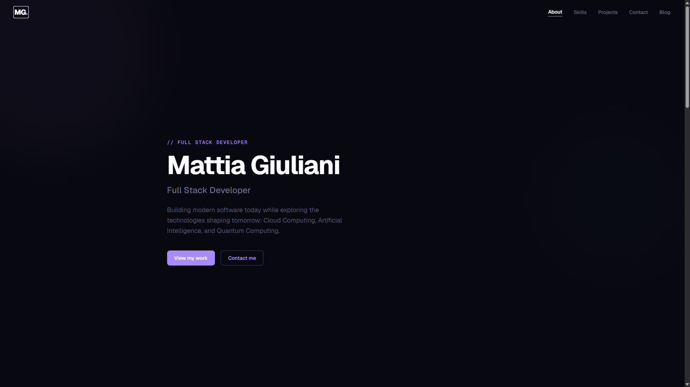
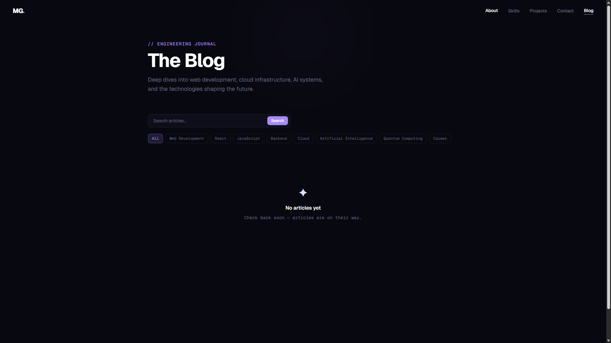
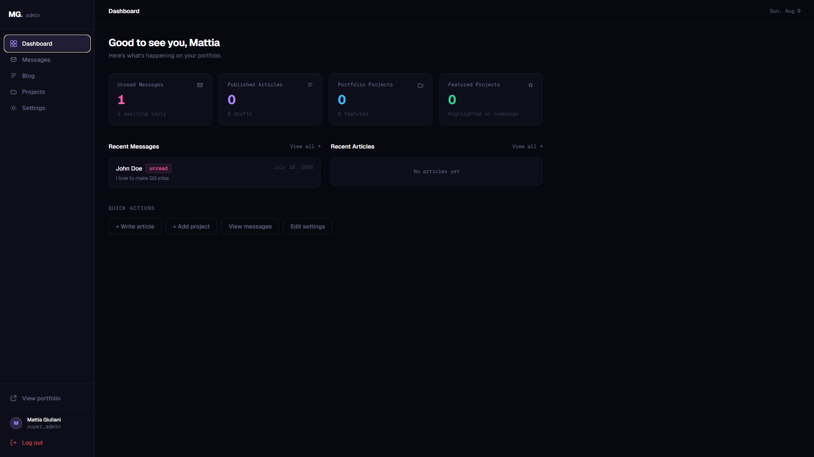
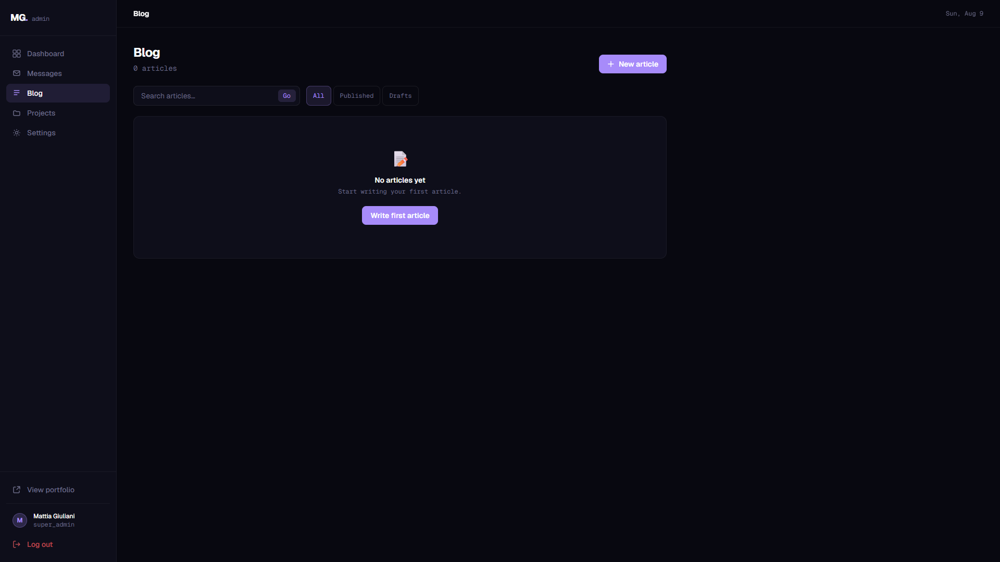
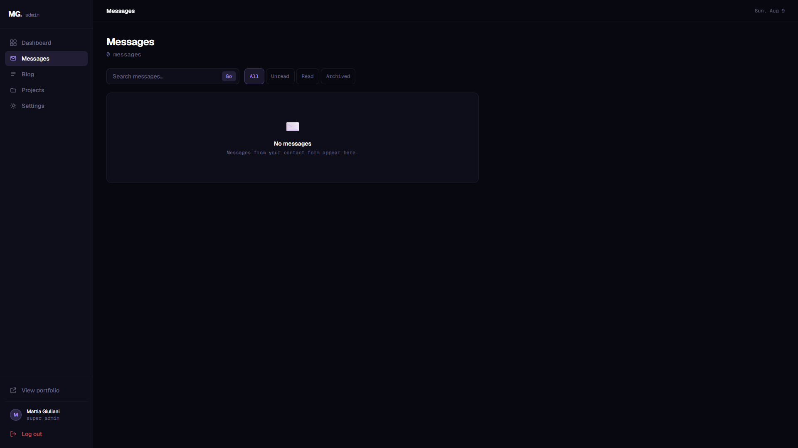
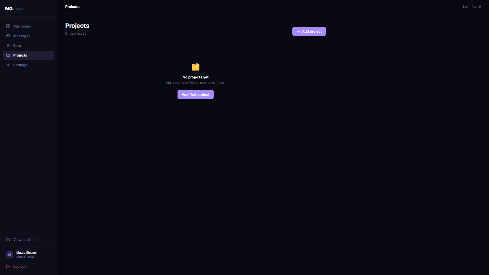

# Mattia Giuliani — Portfolio

Personal portfolio, blog platform and admin dashboard built as a production-ready full-stack application.

[🌐 Live Demo](https://mattiagiuliani-portfolio.vercel.app/) · [💻 GitHub](https://github.com/mattiagiuliani) · [💼 LinkedIn](https://www.linkedin.com/in/mattia-giuliani-dev) · [𝕏 X](https://x.com/mattiacodes)


(


---

## Screenshots

| Portfolio | Blog |
|:---------:|:----:|
|  |  |

| Admin Dashboard | Blog Editor |
|:--------------:|:-----------:|
|  |  |

| Messages | Projects |
|:--------:|:--------:|
|  |  |

---

## English

### Overview

This is not a template. It started as a contact form and grew into a complete system: a public portfolio with a technical blog, a REST API, JWT-based authentication, and a private admin dashboard to manage everything without touching the codebase.

The stack was chosen deliberately — no overcomplicated abstractions, no unnecessary dependencies. Each layer does one thing and does it well.

> The admin dashboard is intentionally protected and is not accessible without valid credentials.

---

### Tech Stack

**Backend**
- Node.js + Express (ES Modules)
- MongoDB + Mongoose
- JWT authentication via HTTP-only cookies with trusted-origin checks for mutations
- bcryptjs (cost factor 12)
- Helmet, express-rate-limit, CORS
- express-validator for input sanitization

**Frontend**
- React 19 + Vite
- Tailwind CSS v4
- Framer Motion
- React Router v7
- react-markdown + remark-gfm

**Infrastructure**
- Docker + Docker Compose
- Render (backend)
- Vercel (frontend)
- MongoDB Atlas

---

### Architecture

```
/
├── backend/                  Express API
│   ├── src/
│   │   ├── config/           Database connection
│   │   ├── controllers/      Business logic
│   │   ├── middleware/       Auth guards, error handler
│   │   ├── models/           Mongoose schemas
│   │   ├── routes/           Public + protected routes
│   │   └── scripts/          One-time seed scripts
│   ├── Dockerfile
│   └── .env.example
│
├── frontend/portfolio/       React application
│   ├── src/
│   │   ├── components/       Shared UI + admin components
│   │   ├── context/          Auth context
│   │   ├── hooks/            useAuth, useActiveSection, useScrollDirection
│   │   ├── lib/              Motion presets, blog utilities
│   │   ├── pages/            Blog pages + admin pages
│   │   ├── sections/         Homepage sections
│   │   └── services/         API layer (blogApi, adminApi, contactApi)
│   ├── Dockerfile
│   └── nginx.conf
│
└── docker-compose.yml
```

---

### Features

**Public portfolio**
- Hero, About, Skills, Projects, Contact sections
- Blog with full Markdown rendering (GFM support), categories, tags, search, pagination
- Blog preview section on the homepage
- Smooth scroll navigation, active section detection
- Contact form wired to the backend

**Admin dashboard** (`/admin`)
- JWT login with HTTP-only cookie — no localStorage, no XSS surface
- Dashboard home with live stats (unread messages, published posts, projects)
- Recent activity feed (messages + posts)
- Message management: search, filter by status, mark as read, archive, delete, detail modal
- Blog management: create/edit with markdown editor, publish/draft toggle, featured toggle
- Project management: CRUD with image preview, featured + published toggles
- Settings: profile, hero text, social links, about section, resume URL

---

### Getting Started

**Prerequisites:** Node.js 22+, MongoDB running locally or an Atlas URI

```bash
# Clone and install
git clone https://github.com/mattiagiuliani/portfolio
cd portfolio

# Backend
cd backend
cp .env.example .env   # fill in your values
npm install
npm run dev            # http://localhost:5000

# Frontend (separate terminal)
cd frontend/portfolio
npm install
npm run dev            # http://localhost:5173
```

**Create the admin account** (run once):

```bash
cd backend
node src/scripts/createAdmin.js
```

Then open `http://localhost:5173/admin/login`.

---

### Environment Variables

Copy `backend/.env.example` to `backend/.env` and fill in the values.

| Variable | Description |
|---|---|
| `MONGODB_URI` | MongoDB connection string (local or Atlas) |
| `JWT_SECRET` | Long random string used to sign authentication tokens | 
| `FRONTEND_ORIGIN` | Allowed CORS origin |
| `NODE_ENV` | `development` or `production` |
| `ADMIN_EMAIL` | Initial admin email |
| `ADMIN_PASSWORD` | Initial admin password (change after first login) |

The frontend reads one variable at build time:

| Variable | Description |
|---|---|
| `VITE_API_URL` | Backend base URL |

---

### Docker

```bash
# Build and start everything
docker compose up --build

# Frontend → http://localhost
# Backend  → http://localhost:5000
```

For a production build, set the backend URL before building:

```yaml
# docker-compose.yml
args:
  VITE_API_URL: https://your-backend.onrender.com
```

---

### Deployment

**Backend → Render**

1. New Web Service → connect repo → Root Directory: `backend`
2. Environment: Docker (uses the `Dockerfile` automatically)
3. Add all environment variables from `.env.example` with real values
4. After deploy, copy the service URL

**Frontend → Vercel**

1. Import project → Root Directory: `frontend/portfolio`
2. Framework: Vite (auto-detected)
3. Add `VITE_API_URL` = your Render URL
4. Deploy → copy the Vercel URL

**Final step:** go back to Render and set `FRONTEND_ORIGIN` to your Vercel URL.

---

### Security

- Write operations on `/api/posts` are removed from the public router — all mutations go through `/api/admin/*` which requires a valid JWT
- JWT is stored in an HTTP-only cookie — inaccessible to JavaScript
- Passwords hashed with bcrypt at cost factor 12
- Login endpoint rate-limited to 10 attempts per 15 minutes
- Global rate limit: 200 requests per 15 minutes
- Helmet sets security headers on every response
- Regex search inputs are escaped before use (ReDoS prevention)
- `.env` is excluded from git via `.gitignore`

---

---

## Italiano

### Panoramica

Questo non è un template. È partito come un semplice form di contatto ed è diventato un sistema completo: portfolio pubblico con blog tecnico, REST API, autenticazione JWT e dashboard admin privata per gestire tutto senza toccare il codice.

Lo stack è stato scelto con criterio — nessuna astrazione inutile, nessuna dipendenza superflua.

> La dashboard admin è intenzionalmente protetta e non è accessibile senza credenziali valide.

---

### Stack Tecnologico

**Backend**
- Node.js + Express (ES Modules)
- MongoDB + Mongoose
- Autenticazione JWT via cookie HTTP-only
- bcryptjs (cost factor 12)
- Helmet, express-rate-limit, CORS
- express-validator per la sanitizzazione degli input

**Frontend**
- React 19 + Vite
- Tailwind CSS v4
- Framer Motion
- React Router v7
- react-markdown + remark-gfm

**Infrastruttura**
- Docker + Docker Compose
- Render (backend)
- Vercel (frontend)
- MongoDB Atlas

---

### Funzionalità

**Portfolio pubblico**
- Sezioni Hero, About, Skills, Projects, Contact
- Blog con rendering Markdown completo, categorie, tag, ricerca, paginazione
- Anteprima blog nella homepage
- Navigazione con scroll fluido e rilevamento sezione attiva
- Form di contatto collegato al backend

**Dashboard admin** (`/admin`)
- Login JWT con cookie HTTP-only e controllo dell'origine — nessun localStorage
- Home con statistiche live: messaggi non letti, articoli pubblicati, progetti
- Feed attività recenti (messaggi + articoli)
- Gestione messaggi: ricerca, filtro per stato, segna come letto, archivia, elimina, modal di dettaglio
- Gestione blog: editor Markdown, toggle pubblicazione/bozza, toggle in evidenza
- Gestione progetti: CRUD con anteprima immagine, toggle featured e published
- Impostazioni: profilo, testo hero, link social, sezione about, link curriculum

---

### Avvio Locale

**Prerequisiti:** Node.js 22+, MongoDB locale o URI Atlas

```bash
# Clona e installa
git clone https://github.com/mattiagiuliani/portfolio
cd portfolio

# Backend
cd backend
cp .env.example .env   # compila i valori
npm install
npm run dev            # http://localhost:5000

# Frontend (terminale separato)
cd frontend/portfolio
npm install
npm run dev            # http://localhost:5173
```

**Crea il primo account admin** (una sola volta):

```bash
cd backend
node src/scripts/createAdmin.js
```

Poi apri `http://localhost:5173/admin/login`.

---

### Variabili d'Ambiente

Copia `backend/.env.example` in `backend/.env` e compila i valori.

| Variabile | Descrizione |
|---|---|
| `MONGODB_URI` | Stringa di connessione MongoDB |
| `JWT_SECRET` | Stringa casuale lunga utilizzata per firmare i token di autenticazione |
| `FRONTEND_ORIGIN` | Origine CORS consentita |
| `NODE_ENV` | `development` o `production` |
| `ADMIN_EMAIL` | Email admin iniziale |
| `ADMIN_PASSWORD` | Password admin iniziale (cambiala al primo accesso) |

Il frontend legge una sola variabile a build time:

| Variabile | Descrizione |
|---|---|
| `VITE_API_URL` | URL base del backend |

---

### Docker

```bash
# Build e avvio
docker compose up --build

# Frontend → http://localhost
# Backend  → http://localhost:5000
```

---

### Deploy

**Backend → Render**

1. New Web Service → collega il repo → Root Directory: `backend`
2. Environment: Docker
3. Aggiungi le variabili d'ambiente dal `.env.example`
4. Dopo il deploy, copia l'URL del servizio

**Frontend → Vercel**

1. Importa il progetto → Root Directory: `frontend/portfolio`
2. Framework: Vite (rilevato automaticamente)
3. Aggiungi `VITE_API_URL` = URL di Render
4. Deploy → copia l'URL Vercel

**Ultimo passaggio:** torna su Render e imposta `FRONTEND_ORIGIN` con l'URL Vercel.

---

### Sicurezza

- Le rotte di scrittura su `/api/posts` sono rimosse dal router pubblico — tutte le mutazioni passano per `/api/admin/*` che richiede un JWT valido
- Il JWT è in un cookie HTTP-only — non accessibile a JavaScript
- Le richieste admin che modificano dati verificano l'origine configurata, per proteggere i cookie cross-origin
- Password hashate con bcrypt a cost factor 12
- Login rate-limitato a 10 tentativi ogni 15 minuti
- Rate limit globale: 200 richieste ogni 15 minuti
- Helmet imposta gli header di sicurezza su ogni risposta
- Gli input di ricerca regex sono escapati prima dell'uso (prevenzione ReDoS)
- `.env` escluso da git tramite `.gitignore`
